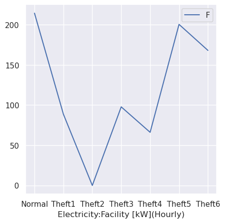
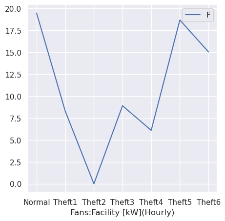
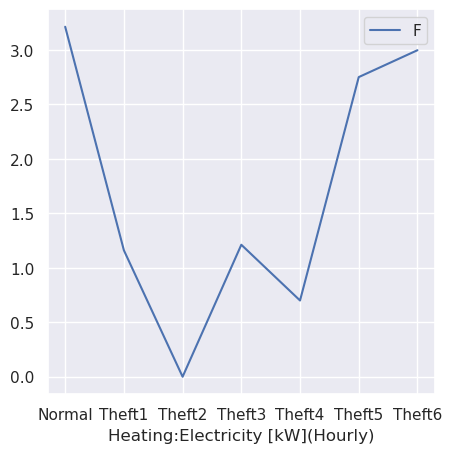
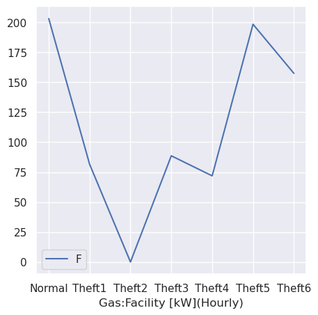
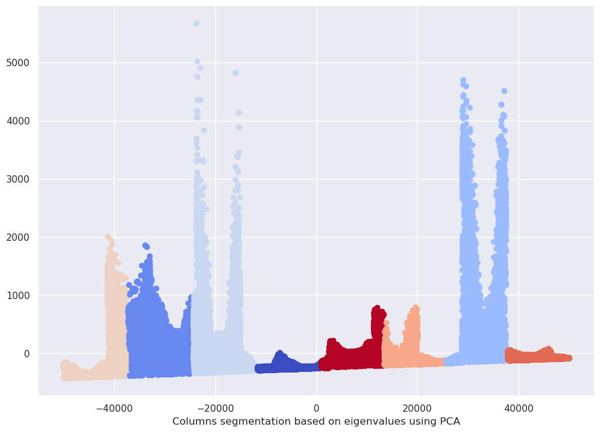
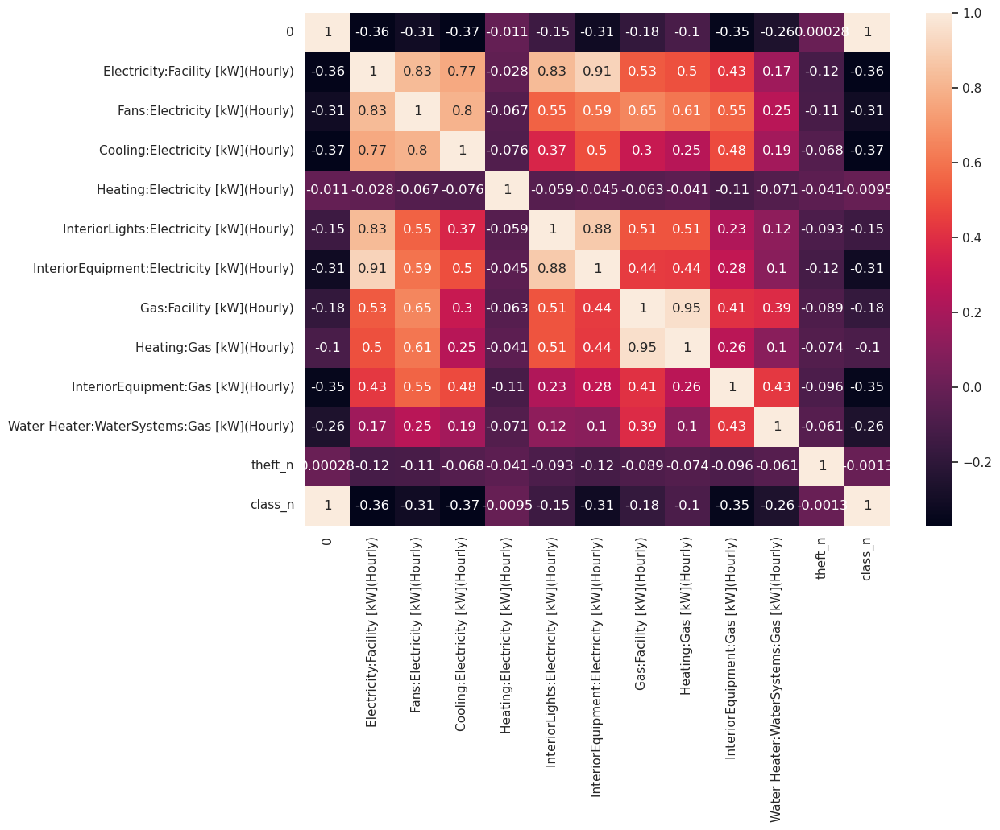
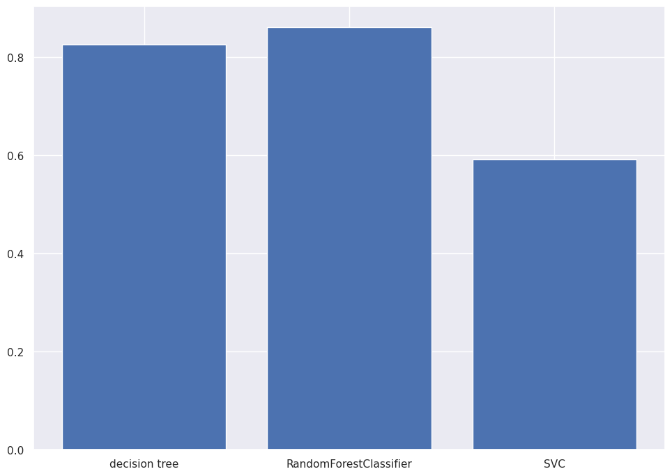
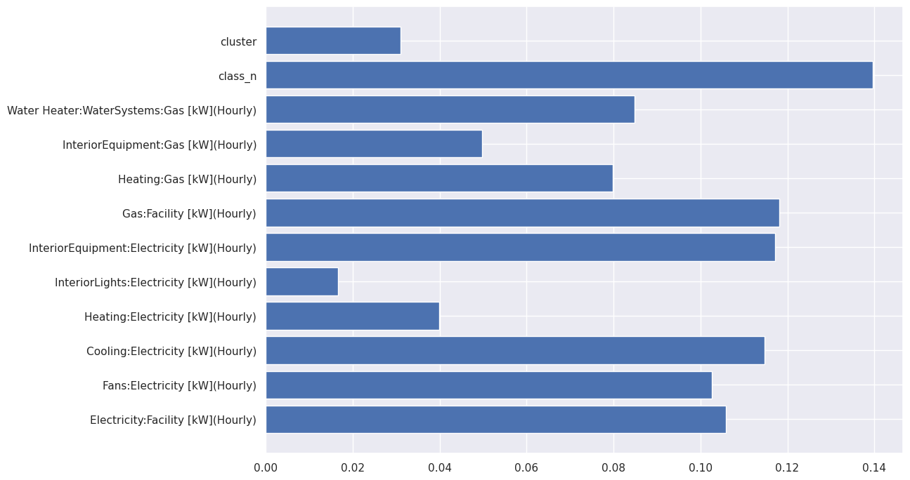

# Sohaib Nasir - Fraud Detection Analysis on gas and electricty theft dataset. Feel free to edit, add and expand on the code


```python
import seaborn as sns
from sklearn.cluster import KMeans
from sklearn.decomposition import PCA

```


```python
from sklearn.tree import DecisionTreeClassifier
from sklearn.metrics import accuracy_score, RocCurveDisplay
from sklearn.model_selection import train_test_split
from sklearn.preprocessing import StandardScaler, LabelEncoder
```


```python

```


```python
import pandas as pd
import numpy as np
import matplotlib.pyplot as plt
```


```python
df = pd.read_csv("df.csv")
```


```python
df = df[:100000]
```

Q1


```python
df.head()
```


<div>
<style scoped>
    .dataframe tbody tr th:only-of-type {
        vertical-align: middle;
    }

    .dataframe tbody tr th {
        vertical-align: top;
    }

    .dataframe thead th {
        text-align: right;
    }
</style>
<table border="1" class="dataframe">
  <thead>
    <tr style="text-align: right;">
      <th></th>
      <th>0</th>
      <th>Electricity:Facility [kW](Hourly)</th>
      <th>Fans:Electricity [kW](Hourly)</th>
      <th>Cooling:Electricity [kW](Hourly)</th>
      <th>Heating:Electricity [kW](Hourly)</th>
      <th>InteriorLights:Electricity [kW](Hourly)</th>
      <th>InteriorEquipment:Electricity [kW](Hourly)</th>
      <th>Gas:Facility [kW](Hourly)</th>
      <th>Heating:Gas [kW](Hourly)</th>
      <th>InteriorEquipment:Gas [kW](Hourly)</th>
      <th>Water Heater:WaterSystems:Gas [kW](Hourly)</th>
      <th>Class</th>
      <th>theft</th>
    </tr>
  </thead>
  <tbody>
    <tr>
      <th>0</th>
      <td>0</td>
      <td>22.035977</td>
      <td>3.586221</td>
      <td>0.0</td>
      <td>0.0</td>
      <td>4.589925</td>
      <td>8.1892</td>
      <td>136.585903</td>
      <td>123.999076</td>
      <td>3.33988</td>
      <td>9.246947</td>
      <td>FullServiceRestaurant</td>
      <td>Normal</td>
    </tr>
    <tr>
      <th>1</th>
      <td>1</td>
      <td>14.649757</td>
      <td>0.000000</td>
      <td>0.0</td>
      <td>0.0</td>
      <td>1.529975</td>
      <td>7.4902</td>
      <td>3.359880</td>
      <td>0.000000</td>
      <td>3.33988</td>
      <td>0.020000</td>
      <td>FullServiceRestaurant</td>
      <td>Normal</td>
    </tr>
    <tr>
      <th>2</th>
      <td>2</td>
      <td>14.669567</td>
      <td>0.000000</td>
      <td>0.0</td>
      <td>0.0</td>
      <td>1.529975</td>
      <td>7.4902</td>
      <td>3.359880</td>
      <td>0.000000</td>
      <td>3.33988</td>
      <td>0.020000</td>
      <td>FullServiceRestaurant</td>
      <td>Normal</td>
    </tr>
    <tr>
      <th>3</th>
      <td>3</td>
      <td>14.677808</td>
      <td>0.000000</td>
      <td>0.0</td>
      <td>0.0</td>
      <td>1.529975</td>
      <td>7.4902</td>
      <td>3.931932</td>
      <td>0.000000</td>
      <td>3.33988</td>
      <td>0.592052</td>
      <td>FullServiceRestaurant</td>
      <td>Normal</td>
    </tr>
    <tr>
      <th>4</th>
      <td>4</td>
      <td>14.824794</td>
      <td>0.000000</td>
      <td>0.0</td>
      <td>0.0</td>
      <td>1.529975</td>
      <td>7.4902</td>
      <td>3.359880</td>
      <td>0.000000</td>
      <td>3.33988</td>
      <td>0.020000</td>
      <td>FullServiceRestaurant</td>
      <td>Normal</td>
    </tr>
  </tbody>
</table>
</div>


```python

```


```python
df.index
```


    RangeIndex(start=0, stop=100000, step=1)


```python
df.columns
```


    Index(['0', 'Electricity:Facility [kW](Hourly)',
           'Fans:Electricity [kW](Hourly)', 'Cooling:Electricity [kW](Hourly)',
           'Heating:Electricity [kW](Hourly)',
           'InteriorLights:Electricity [kW](Hourly)',
           'InteriorEquipment:Electricity [kW](Hourly)',
           'Gas:Facility [kW](Hourly)', 'Heating:Gas [kW](Hourly)',
           'InteriorEquipment:Gas [kW](Hourly)',
           'Water Heater:WaterSystems:Gas [kW](Hourly)', 'Class', 'theft'],
          dtype='object')


```python
print(df.isnull().sum())
```

    0                                             0
    Electricity:Facility [kW](Hourly)             0
    Fans:Electricity [kW](Hourly)                 0
    Cooling:Electricity [kW](Hourly)              0
    Heating:Electricity [kW](Hourly)              0
    InteriorLights:Electricity [kW](Hourly)       0
    InteriorEquipment:Electricity [kW](Hourly)    0
    Gas:Facility [kW](Hourly)                     0
    Heating:Gas [kW](Hourly)                      0
    InteriorEquipment:Gas [kW](Hourly)            0
    Water Heater:WaterSystems:Gas [kW](Hourly)    0
    Class                                         0
    theft                                         0
    dtype: int64
    

Q2


```python
df.describe()
```


<div>
<style scoped>
    .dataframe tbody tr th:only-of-type {
        vertical-align: middle;
    }

    .dataframe tbody tr th {
        vertical-align: top;
    }

    .dataframe thead th {
        text-align: right;
    }
</style>
<table border="1" class="dataframe">
  <thead>
    <tr style="text-align: right;">
      <th></th>
      <th>0</th>
      <th>Electricity:Facility [kW](Hourly)</th>
      <th>Fans:Electricity [kW](Hourly)</th>
      <th>Cooling:Electricity [kW](Hourly)</th>
      <th>Heating:Electricity [kW](Hourly)</th>
      <th>InteriorLights:Electricity [kW](Hourly)</th>
      <th>InteriorEquipment:Electricity [kW](Hourly)</th>
      <th>Gas:Facility [kW](Hourly)</th>
      <th>Heating:Gas [kW](Hourly)</th>
      <th>InteriorEquipment:Gas [kW](Hourly)</th>
      <th>Water Heater:WaterSystems:Gas [kW](Hourly)</th>
    </tr>
  </thead>
  <tbody>
    <tr>
      <th>count</th>
      <td>100000.000000</td>
      <td>100000.000000</td>
      <td>100000.000000</td>
      <td>100000.000000</td>
      <td>100000.000000</td>
      <td>100000.000000</td>
      <td>100000.000000</td>
      <td>100000.000000</td>
      <td>100000.000000</td>
      <td>100000.000000</td>
      <td>100000.000000</td>
    </tr>
    <tr>
      <th>mean</th>
      <td>49999.500000</td>
      <td>170.504106</td>
      <td>15.520723</td>
      <td>27.365939</td>
      <td>2.510368</td>
      <td>40.804930</td>
      <td>56.786812</td>
      <td>162.120442</td>
      <td>120.957171</td>
      <td>10.976595</td>
      <td>30.186676</td>
    </tr>
    <tr>
      <th>std</th>
      <td>28867.657797</td>
      <td>262.591217</td>
      <td>25.592934</td>
      <td>76.418531</td>
      <td>11.186164</td>
      <td>75.120162</td>
      <td>82.239409</td>
      <td>309.472830</td>
      <td>282.304963</td>
      <td>17.961045</td>
      <td>83.802884</td>
    </tr>
    <tr>
      <th>min</th>
      <td>0.000000</td>
      <td>0.000000</td>
      <td>0.000000</td>
      <td>0.000000</td>
      <td>0.000000</td>
      <td>0.000000</td>
      <td>0.000000</td>
      <td>0.000000</td>
      <td>0.000000</td>
      <td>0.000000</td>
      <td>0.000000</td>
    </tr>
    <tr>
      <th>25%</th>
      <td>24999.750000</td>
      <td>22.400137</td>
      <td>0.674879</td>
      <td>0.000000</td>
      <td>0.000000</td>
      <td>3.711679</td>
      <td>12.389003</td>
      <td>7.448981</td>
      <td>0.087927</td>
      <td>0.000000</td>
      <td>0.716225</td>
    </tr>
    <tr>
      <th>50%</th>
      <td>49999.500000</td>
      <td>57.714562</td>
      <td>3.501264</td>
      <td>0.000000</td>
      <td>0.000000</td>
      <td>12.925469</td>
      <td>24.310628</td>
      <td>46.887881</td>
      <td>23.256759</td>
      <td>3.205680</td>
      <td>5.190401</td>
    </tr>
    <tr>
      <th>75%</th>
      <td>74999.250000</td>
      <td>184.642740</td>
      <td>22.604600</td>
      <td>7.667478</td>
      <td>0.000000</td>
      <td>43.513342</td>
      <td>62.794788</td>
      <td>141.229983</td>
      <td>90.279053</td>
      <td>14.380750</td>
      <td>17.501992</td>
    </tr>
    <tr>
      <th>max</th>
      <td>99999.000000</td>
      <td>1395.143720</td>
      <td>117.252946</td>
      <td>403.946983</td>
      <td>277.996520</td>
      <td>448.566544</td>
      <td>448.566544</td>
      <td>4491.695087</td>
      <td>4480.732902</td>
      <td>91.799800</td>
      <td>783.877898</td>
    </tr>
  </tbody>
</table>
</div>


Q4


```python
df.head()
```


<div>
<style scoped>
    .dataframe tbody tr th:only-of-type {
        vertical-align: middle;
    }

    .dataframe tbody tr th {
        vertical-align: top;
    }

    .dataframe thead th {
        text-align: right;
    }
</style>
<table border="1" class="dataframe">
  <thead>
    <tr style="text-align: right;">
      <th></th>
      <th>0</th>
      <th>Electricity:Facility [kW](Hourly)</th>
      <th>Fans:Electricity [kW](Hourly)</th>
      <th>Cooling:Electricity [kW](Hourly)</th>
      <th>Heating:Electricity [kW](Hourly)</th>
      <th>InteriorLights:Electricity [kW](Hourly)</th>
      <th>InteriorEquipment:Electricity [kW](Hourly)</th>
      <th>Gas:Facility [kW](Hourly)</th>
      <th>Heating:Gas [kW](Hourly)</th>
      <th>InteriorEquipment:Gas [kW](Hourly)</th>
      <th>Water Heater:WaterSystems:Gas [kW](Hourly)</th>
      <th>Class</th>
      <th>theft</th>
    </tr>
  </thead>
  <tbody>
    <tr>
      <th>0</th>
      <td>0</td>
      <td>22.035977</td>
      <td>3.586221</td>
      <td>0.0</td>
      <td>0.0</td>
      <td>4.589925</td>
      <td>8.1892</td>
      <td>136.585903</td>
      <td>123.999076</td>
      <td>3.33988</td>
      <td>9.246947</td>
      <td>FullServiceRestaurant</td>
      <td>Normal</td>
    </tr>
    <tr>
      <th>1</th>
      <td>1</td>
      <td>14.649757</td>
      <td>0.000000</td>
      <td>0.0</td>
      <td>0.0</td>
      <td>1.529975</td>
      <td>7.4902</td>
      <td>3.359880</td>
      <td>0.000000</td>
      <td>3.33988</td>
      <td>0.020000</td>
      <td>FullServiceRestaurant</td>
      <td>Normal</td>
    </tr>
    <tr>
      <th>2</th>
      <td>2</td>
      <td>14.669567</td>
      <td>0.000000</td>
      <td>0.0</td>
      <td>0.0</td>
      <td>1.529975</td>
      <td>7.4902</td>
      <td>3.359880</td>
      <td>0.000000</td>
      <td>3.33988</td>
      <td>0.020000</td>
      <td>FullServiceRestaurant</td>
      <td>Normal</td>
    </tr>
    <tr>
      <th>3</th>
      <td>3</td>
      <td>14.677808</td>
      <td>0.000000</td>
      <td>0.0</td>
      <td>0.0</td>
      <td>1.529975</td>
      <td>7.4902</td>
      <td>3.931932</td>
      <td>0.000000</td>
      <td>3.33988</td>
      <td>0.592052</td>
      <td>FullServiceRestaurant</td>
      <td>Normal</td>
    </tr>
    <tr>
      <th>4</th>
      <td>4</td>
      <td>14.824794</td>
      <td>0.000000</td>
      <td>0.0</td>
      <td>0.0</td>
      <td>1.529975</td>
      <td>7.4902</td>
      <td>3.359880</td>
      <td>0.000000</td>
      <td>3.33988</td>
      <td>0.020000</td>
      <td>FullServiceRestaurant</td>
      <td>Normal</td>
    </tr>
  </tbody>
</table>
</div>


```python
vs = df.groupby('theft')['Electricity:Facility [kW](Hourly)'].mean()
```


```python
vs
```


    theft
    Normal    214.348512
    Theft1     88.671065
    Theft2      0.000000
    Theft3     97.781416
    Theft4     66.122837
    Theft5    200.419728
    Theft6    168.029990
    Name: Electricity:Facility [kW](Hourly), dtype: float64


```python
vs.plot(kind = 'line',figsize=(5, 5))
plt.legend('Facility')
plt.xlabel('Electricity:Facility [kW](Hourly)')
```


    Text(0.5, 0, 'Electricity:Facility [kW](Hourly)')


    

    


```python
vs2 = df.groupby('theft')['Fans:Electricity [kW](Hourly)'].mean()
vs2.plot(kind = 'line',figsize=(5, 5))
plt.legend('Facility')
plt.xlabel('Fans:Facility [kW](Hourly)')
```


    Text(0.5, 0, 'Fans:Facility [kW](Hourly)')


    

    


```python
vs3 = df.groupby('theft')['Heating:Electricity [kW](Hourly)'].mean()
vs3.plot(kind = 'line',figsize=(5, 5))
plt.legend('Facility')
plt.xlabel('Heating:Electricity [kW](Hourly)')
```


    Text(0.5, 0, 'Heating:Electricity [kW](Hourly)')


    

    


```python
vs4 = df.groupby('theft')['Gas:Facility [kW](Hourly)'].mean()
vs4.plot(kind = 'line',figsize=(5, 5))
plt.legend('Facility')
plt.xlabel('Gas:Facility [kW](Hourly)')
```


    Text(0.5, 0, 'Gas:Facility [kW](Hourly)')


    

    


Q3


```python
df['Class'].unique()
```


    array(['FullServiceRestaurant', 'Hospital', 'LargeHotel', 'LargeOffice',
           'MediumOffice', 'MidriseApartment', 'OutPatient', 'PrimarySchool',
           'QuickServiceRestaurant', 'SecondarySchool', 'SmallHotel',
           'SmallOffice'], dtype=object)


```python
theft_list  = df['theft'].unique().tolist()
class_list  = df['Class'].unique().tolist()
```


```python
le_theft = LabelEncoder()
le_class = LabelEncoder()
```


```python
df['theft_n'] = le_theft.fit_transform(df['theft'])
df['class_n'] = le_class.fit_transform(df['Class'])
```


```python

```


```python
print(theft_list)
```

    ['Normal', 'Theft5', 'Theft6', 'Theft2', 'Theft3', 'Theft4', 'Theft1']
    


```python
df.head()
```


<div>
<style scoped>
    .dataframe tbody tr th:only-of-type {
        vertical-align: middle;
    }

    .dataframe tbody tr th {
        vertical-align: top;
    }

    .dataframe thead th {
        text-align: right;
    }
</style>
<table border="1" class="dataframe">
  <thead>
    <tr style="text-align: right;">
      <th></th>
      <th>0</th>
      <th>Electricity:Facility [kW](Hourly)</th>
      <th>Fans:Electricity [kW](Hourly)</th>
      <th>Cooling:Electricity [kW](Hourly)</th>
      <th>Heating:Electricity [kW](Hourly)</th>
      <th>InteriorLights:Electricity [kW](Hourly)</th>
      <th>InteriorEquipment:Electricity [kW](Hourly)</th>
      <th>Gas:Facility [kW](Hourly)</th>
      <th>Heating:Gas [kW](Hourly)</th>
      <th>InteriorEquipment:Gas [kW](Hourly)</th>
      <th>Water Heater:WaterSystems:Gas [kW](Hourly)</th>
      <th>Class</th>
      <th>theft</th>
      <th>theft_n</th>
      <th>class_n</th>
    </tr>
  </thead>
  <tbody>
    <tr>
      <th>0</th>
      <td>0</td>
      <td>22.035977</td>
      <td>3.586221</td>
      <td>0.0</td>
      <td>0.0</td>
      <td>4.589925</td>
      <td>8.1892</td>
      <td>136.585903</td>
      <td>123.999076</td>
      <td>3.33988</td>
      <td>9.246947</td>
      <td>FullServiceRestaurant</td>
      <td>Normal</td>
      <td>0</td>
      <td>0</td>
    </tr>
    <tr>
      <th>1</th>
      <td>1</td>
      <td>14.649757</td>
      <td>0.000000</td>
      <td>0.0</td>
      <td>0.0</td>
      <td>1.529975</td>
      <td>7.4902</td>
      <td>3.359880</td>
      <td>0.000000</td>
      <td>3.33988</td>
      <td>0.020000</td>
      <td>FullServiceRestaurant</td>
      <td>Normal</td>
      <td>0</td>
      <td>0</td>
    </tr>
    <tr>
      <th>2</th>
      <td>2</td>
      <td>14.669567</td>
      <td>0.000000</td>
      <td>0.0</td>
      <td>0.0</td>
      <td>1.529975</td>
      <td>7.4902</td>
      <td>3.359880</td>
      <td>0.000000</td>
      <td>3.33988</td>
      <td>0.020000</td>
      <td>FullServiceRestaurant</td>
      <td>Normal</td>
      <td>0</td>
      <td>0</td>
    </tr>
    <tr>
      <th>3</th>
      <td>3</td>
      <td>14.677808</td>
      <td>0.000000</td>
      <td>0.0</td>
      <td>0.0</td>
      <td>1.529975</td>
      <td>7.4902</td>
      <td>3.931932</td>
      <td>0.000000</td>
      <td>3.33988</td>
      <td>0.592052</td>
      <td>FullServiceRestaurant</td>
      <td>Normal</td>
      <td>0</td>
      <td>0</td>
    </tr>
    <tr>
      <th>4</th>
      <td>4</td>
      <td>14.824794</td>
      <td>0.000000</td>
      <td>0.0</td>
      <td>0.0</td>
      <td>1.529975</td>
      <td>7.4902</td>
      <td>3.359880</td>
      <td>0.000000</td>
      <td>3.33988</td>
      <td>0.020000</td>
      <td>FullServiceRestaurant</td>
      <td>Normal</td>
      <td>0</td>
      <td>0</td>
    </tr>
  </tbody>
</table>
</div>


```python
df.drop('theft',axis = 1,inplace =True)
df.drop('Class',axis = 1,inplace =True)
```


```python
df.head()
```


<div>
<style scoped>
    .dataframe tbody tr th:only-of-type {
        vertical-align: middle;
    }

    .dataframe tbody tr th {
        vertical-align: top;
    }

    .dataframe thead th {
        text-align: right;
    }
</style>
<table border="1" class="dataframe">
  <thead>
    <tr style="text-align: right;">
      <th></th>
      <th>0</th>
      <th>Electricity:Facility [kW](Hourly)</th>
      <th>Fans:Electricity [kW](Hourly)</th>
      <th>Cooling:Electricity [kW](Hourly)</th>
      <th>Heating:Electricity [kW](Hourly)</th>
      <th>InteriorLights:Electricity [kW](Hourly)</th>
      <th>InteriorEquipment:Electricity [kW](Hourly)</th>
      <th>Gas:Facility [kW](Hourly)</th>
      <th>Heating:Gas [kW](Hourly)</th>
      <th>InteriorEquipment:Gas [kW](Hourly)</th>
      <th>Water Heater:WaterSystems:Gas [kW](Hourly)</th>
      <th>theft_n</th>
      <th>class_n</th>
    </tr>
  </thead>
  <tbody>
    <tr>
      <th>0</th>
      <td>0</td>
      <td>22.035977</td>
      <td>3.586221</td>
      <td>0.0</td>
      <td>0.0</td>
      <td>4.589925</td>
      <td>8.1892</td>
      <td>136.585903</td>
      <td>123.999076</td>
      <td>3.33988</td>
      <td>9.246947</td>
      <td>0</td>
      <td>0</td>
    </tr>
    <tr>
      <th>1</th>
      <td>1</td>
      <td>14.649757</td>
      <td>0.000000</td>
      <td>0.0</td>
      <td>0.0</td>
      <td>1.529975</td>
      <td>7.4902</td>
      <td>3.359880</td>
      <td>0.000000</td>
      <td>3.33988</td>
      <td>0.020000</td>
      <td>0</td>
      <td>0</td>
    </tr>
    <tr>
      <th>2</th>
      <td>2</td>
      <td>14.669567</td>
      <td>0.000000</td>
      <td>0.0</td>
      <td>0.0</td>
      <td>1.529975</td>
      <td>7.4902</td>
      <td>3.359880</td>
      <td>0.000000</td>
      <td>3.33988</td>
      <td>0.020000</td>
      <td>0</td>
      <td>0</td>
    </tr>
    <tr>
      <th>3</th>
      <td>3</td>
      <td>14.677808</td>
      <td>0.000000</td>
      <td>0.0</td>
      <td>0.0</td>
      <td>1.529975</td>
      <td>7.4902</td>
      <td>3.931932</td>
      <td>0.000000</td>
      <td>3.33988</td>
      <td>0.592052</td>
      <td>0</td>
      <td>0</td>
    </tr>
    <tr>
      <th>4</th>
      <td>4</td>
      <td>14.824794</td>
      <td>0.000000</td>
      <td>0.0</td>
      <td>0.0</td>
      <td>1.529975</td>
      <td>7.4902</td>
      <td>3.359880</td>
      <td>0.000000</td>
      <td>3.33988</td>
      <td>0.020000</td>
      <td>0</td>
      <td>0</td>
    </tr>
  </tbody>
</table>
</div>


```python
X  = df.drop('theft_n',axis = 1)
```


```python
X.head()
```


<div>
<style scoped>
    .dataframe tbody tr th:only-of-type {
        vertical-align: middle;
    }

    .dataframe tbody tr th {
        vertical-align: top;
    }

    .dataframe thead th {
        text-align: right;
    }
</style>
<table border="1" class="dataframe">
  <thead>
    <tr style="text-align: right;">
      <th></th>
      <th>0</th>
      <th>Electricity:Facility [kW](Hourly)</th>
      <th>Fans:Electricity [kW](Hourly)</th>
      <th>Cooling:Electricity [kW](Hourly)</th>
      <th>Heating:Electricity [kW](Hourly)</th>
      <th>InteriorLights:Electricity [kW](Hourly)</th>
      <th>InteriorEquipment:Electricity [kW](Hourly)</th>
      <th>Gas:Facility [kW](Hourly)</th>
      <th>Heating:Gas [kW](Hourly)</th>
      <th>InteriorEquipment:Gas [kW](Hourly)</th>
      <th>Water Heater:WaterSystems:Gas [kW](Hourly)</th>
      <th>class_n</th>
    </tr>
  </thead>
  <tbody>
    <tr>
      <th>0</th>
      <td>0</td>
      <td>22.035977</td>
      <td>3.586221</td>
      <td>0.0</td>
      <td>0.0</td>
      <td>4.589925</td>
      <td>8.1892</td>
      <td>136.585903</td>
      <td>123.999076</td>
      <td>3.33988</td>
      <td>9.246947</td>
      <td>0</td>
    </tr>
    <tr>
      <th>1</th>
      <td>1</td>
      <td>14.649757</td>
      <td>0.000000</td>
      <td>0.0</td>
      <td>0.0</td>
      <td>1.529975</td>
      <td>7.4902</td>
      <td>3.359880</td>
      <td>0.000000</td>
      <td>3.33988</td>
      <td>0.020000</td>
      <td>0</td>
    </tr>
    <tr>
      <th>2</th>
      <td>2</td>
      <td>14.669567</td>
      <td>0.000000</td>
      <td>0.0</td>
      <td>0.0</td>
      <td>1.529975</td>
      <td>7.4902</td>
      <td>3.359880</td>
      <td>0.000000</td>
      <td>3.33988</td>
      <td>0.020000</td>
      <td>0</td>
    </tr>
    <tr>
      <th>3</th>
      <td>3</td>
      <td>14.677808</td>
      <td>0.000000</td>
      <td>0.0</td>
      <td>0.0</td>
      <td>1.529975</td>
      <td>7.4902</td>
      <td>3.931932</td>
      <td>0.000000</td>
      <td>3.33988</td>
      <td>0.592052</td>
      <td>0</td>
    </tr>
    <tr>
      <th>4</th>
      <td>4</td>
      <td>14.824794</td>
      <td>0.000000</td>
      <td>0.0</td>
      <td>0.0</td>
      <td>1.529975</td>
      <td>7.4902</td>
      <td>3.359880</td>
      <td>0.000000</td>
      <td>3.33988</td>
      <td>0.020000</td>
      <td>0</td>
    </tr>
  </tbody>
</table>
</div>


```python
y
```


    0        0
    1        0
    2        0
    3        0
    4        0
            ..
    99995    0
    99996    0
    99997    0
    99998    0
    99999    0
    Name: theft_n, Length: 100000, dtype: int64


```python

```


```python

```


```python

```


```python

```


```python

```

Q8


```python
X_train, X_test, y_train, y_test = train_test_split(X,y,train_size = 0.2, random_state = 42)
```


```python
kmeans = KMeans(n_clusters=8,random_state=0).fit(X)
X['cluster'] = kmeans.labels_

```


```python
x_pca=PCA(n_components=5).fit_transform(X)
```


```python
cols = df.columns.tolist()
```


```python
plt.scatter(x_pca[:,0],x_pca[:,1],c  = X['cluster'],cmap = 'coolwarm')
plt.xlabel("Columns segmentation based on eigenvalues using PCA")
```


    Text(0.5, 0, 'Columns segmentation based on eigenvalues using PCA')


    

    


```python
#fea = x_pca.get_feature_names_out()
```

Q5


```python
correlation_matrix = df.corr()
sns.set_theme(rc={'figure.figsize':(11.7,8.27)})
```


```python
sns.heatmap(correlation_matrix, annot=True)
plt.show()
```


    

    


Q6


```python
from sklearn.tree import DecisionTreeClassifier

```


```python
tre = DecisionTreeClassifier()
tre.fit(X_train, y_train)
pred1 = tre.predict(X_test)
```


```python
print(accuracy_score(y_test,pred1))
```

    0.826075
    


```python
#disp = RocCurveDisplay.from_predictions(y_test,pred1)
```


```python

```


```python

```


```python

```


```python
from sklearn.ensemble import RandomForestClassifier
```


```python
rf = RandomForestClassifier()
rf.fit(X_train, y_train)
pred2 = rf.predict(X_test)
```


```python
print(accuracy_score(y_test,pred2))
```

    0.861025
    


```python
#disp = RocCurveDisplay.from_predictions(y_test,pred3)
```


```python
from sklearn.svm import SVC
```


```python
sv = SVC()
sv.fit(X_train, y_train)
pred3 = sv.predict(X_test)
```


```python
print(accuracy_score(y_test,pred3))
```

    0.5913
    

Q7


```python
plt.bar(['decision tree','RandomForestClassifier','SVC'],[accuracy_score(y_test,pred1),accuracy_score(y_test,pred2),accuracy_score(y_test,pred3)])
```


    <BarContainer object of 3 artists>


    

    


```python
importances = rf.feature_importances_
```


```python
print(X.columns)
```

    Index(['0', 'Electricity:Facility [kW](Hourly)',
           'Fans:Electricity [kW](Hourly)', 'Cooling:Electricity [kW](Hourly)',
           'Heating:Electricity [kW](Hourly)',
           'InteriorLights:Electricity [kW](Hourly)',
           'InteriorEquipment:Electricity [kW](Hourly)',
           'Gas:Facility [kW](Hourly)', 'Heating:Gas [kW](Hourly)',
           'InteriorEquipment:Gas [kW](Hourly)',
           'Water Heater:WaterSystems:Gas [kW](Hourly)', 'class_n', 'cluster'],
          dtype='object')
    

Q9,11


```python

```


```python
plt.barh(['Electricity:Facility [kW](Hourly)',
       'Fans:Electricity [kW](Hourly)', 'Cooling:Electricity [kW](Hourly)',
       'Heating:Electricity [kW](Hourly)',
       'InteriorLights:Electricity [kW](Hourly)',
       'InteriorEquipment:Electricity [kW](Hourly)',
       'Gas:Facility [kW](Hourly)', 'Heating:Gas [kW](Hourly)',
       'InteriorEquipment:Gas [kW](Hourly)',
       'Water Heater:WaterSystems:Gas [kW](Hourly)', 'class_n', 'cluster'], importances, align='center')
```


    <BarContainer object of 12 artists>


    

    


Q10
We find from using random forest classifier that the feature of most importance in dataset is class_n meaning the type of theft commited. from model plots we find that random forest classifier best fits.


```python

```
